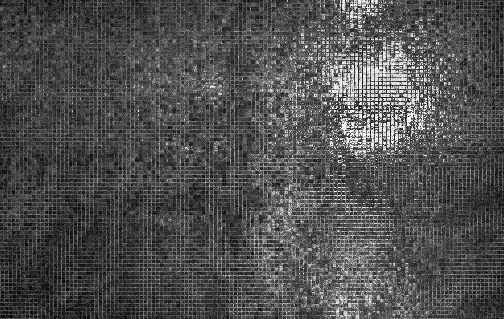

Hi I'm 
# Rafael Jonathan 

I'm a full-stack web developer, ui/ux designer who specializes in front-end development. I make it my mission to translate user-focused design into pixel perfect website or application that run blazing fast.

Know more about me? [Check out my Portfolio!](https://www.linkedin.com/in/rafael-jonathan/)

My Links
-----
---
- Website: [rafaelj.com](https://www.linkedin.com/in/rafael-jonathan/)
- Github: [@rafadev777](https://www.linkedin.com/in/rafael-jonathan/)
- Linkedin: [rafaeljonathan](https://www.linkedin.com/in/rafael-jonathan/)

My Technical Skills
-----
---
1. VS Code
2. Markdown
3. Git
4. GitHub

 My Favorite Website
-----
---

Name     | Url | Reason 
-------- | -------- | -------- 
Stack Overflow | https://stackoverflow.com | good community to solve coding problem
LinkedIn | https://www.linkedin.com | good for networking
Medium | https://medium.com | Good reading source

